<h1 align="center">School Projects</h1>
Here lies a journal of school coding projects and assignments I have completed at University of California, Berkeley and North Carolina State University. I cannot share the source code of most of the projects because of confidentiality and plagarism, so I will summarize my thoughts and findings here instead. If possible, I will also include a link to the project spec. Having a journal like this helps me keep track of the plethora of projects I've completed at Berkeley and NCSU! Sometimes, I'll read this back in reminiscence of my time at school, so you'll see some personal anecdotes inserted. The projects are presented in sequential order of when I completed them. I hope you enjoy reading this as much as I enjoyed coding these projects!

<h2 align="center">Hog</h2>

    

    <a href="https://inst.eecs.berkeley.edu/~cs61a/sp19/proj/hog/">Spec</a>

My first CS project at UC Berkeley where I was exposed to functional programming and Python. Implemented a made up dice game of Hog. GUI was done in Tkinter. I remember the excitement I got when I passed all of the unit tests in the Main Stacks library. I couldn't hold myself together of excitement and this was one of the moments in life where I actually enjoyed doing assignments and solving problems. I was a chemistry major at the time, overwhelmed from all of the problem sets and organic chemistry theory that passed through my brain. But after this project I knew I wanted to pursue a degree and career in CS. Something about problem solving and converting that into workable code amazed me. I was hooked.

    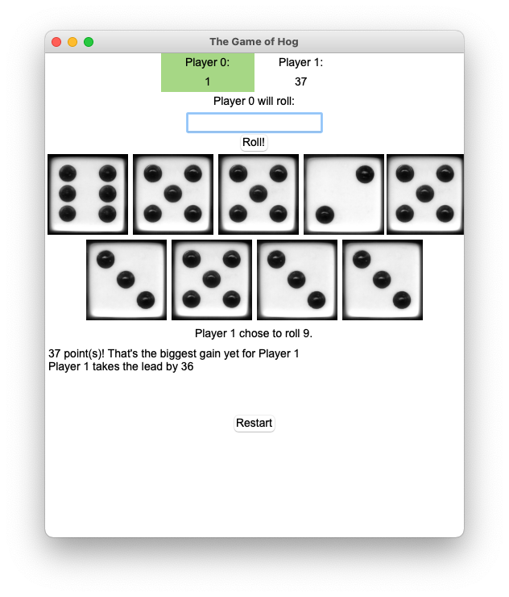

<h2 align="center">Yelp Maps</h2>

    

    <a href="https://inst.eecs.berkeley.edu/~cs61a/sp19/proj/maps/">Spec</a>

A project where I was exposed to the list comprehensions, data structures, and data abstractions. Created a Voronoi diagram of reccomendations overlaying on the map of Berkeley campus! It used simple machine learning algorithms such as centroid method and $k$-means clustering algorithm to reccomend restaurants based on Yelp Academic Dataset. Overall, gave a taste of supervised/unsupervised learning and peaked my interest in AI/ML. Did I celebrate with a nice meal reccomended by my program? Of course I did! Ended up trying a sandwich shop called [The Stuffed In](https://goo.gl/maps/78LpdrPkWYG4Um2SA). Highly reccomend it if you're ever in Berkeley!

    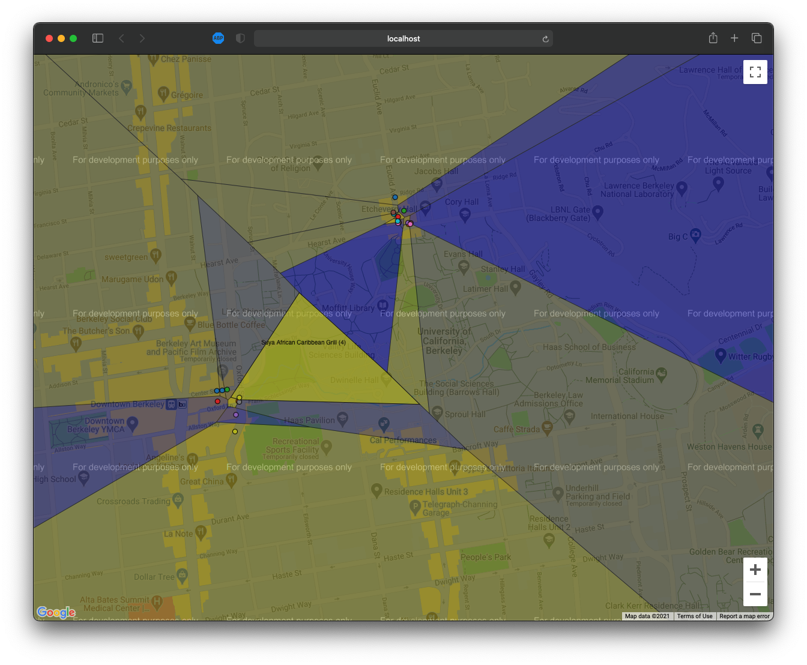

<h2 align="center">Ants vs. Bees</h2>

    

    <a href="https://inst.eecs.berkeley.edu/~cs61a/sp19/proj/ants/">Spec</a>

This project exercised object oriented programming with a fun little web app game inspired by the popular mobile tower defense game classic: Plants vs. Zombies. Dealt with classes, super classes, methods, attributes, and much much more to develop a fully working game!

    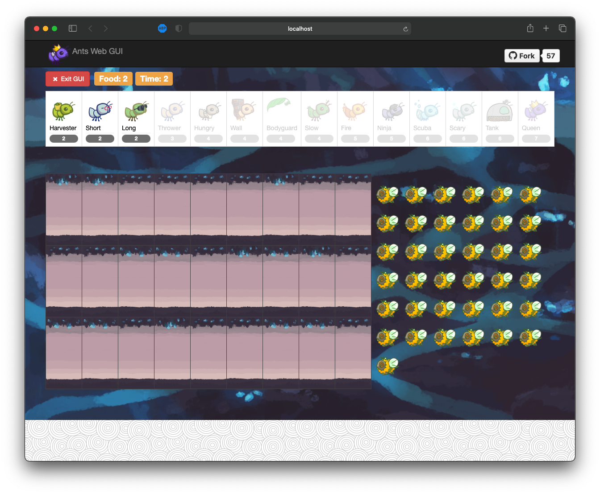

<h2 align="center">Scheme Interpreter</h2>

    

    <a href="https://inst.eecs.berkeley.edu/~cs61a/sp19/proj/scheme/">Spec</a>

Built a full interpreter in Python for Scheme. The program fully replicates the REPL (Read Eval Print Loop) environment of Scheme. This was a really cool project building a functional programming language and interpreter from scratch with an already interpreted lanugage! We also learned Scheme on the side, and it was satisfying to run all of my homework code in Scheme successfully with this project! I remember cranking out the last bug in my project during office hours. I finally fixed it and submitted my final version while in Kresge Library. I was happy that I finally finished my last project of my first CS course.

    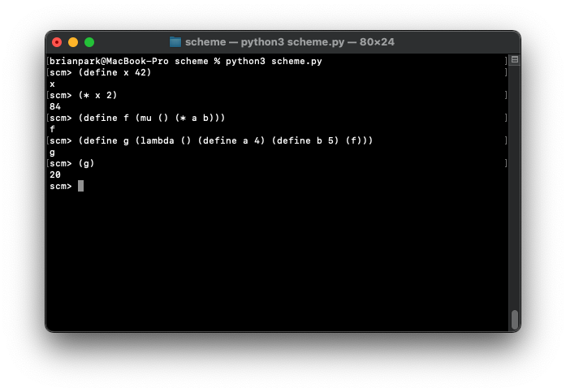

<h2 align="center">Discrete Mathematics and Probability Homework</h2>

    

Wrote up homework solutions through LaTeX and visualized problems with Python. Learned about the fundamentals of discrete mathematics and probability, such as proofs, induction, graphs, modular arithmetic, RSA, counting, Bayes' Rule, random variables, probability distirubtions, expectations, variance, Markov Chains, and much much more. It was painful to understand the math, but I'm glad I survived as it setup the foundation for the rest of my math and computer science courses. It was also my first time learning LaTeX. I remember originally turning in handwritten solutions but wasn't satisfied with my homework grades. Once I turned in LaTeX written solutions, my grades for homework consistently went up. Maybe it was the neatness, but I've never did a CS homework or problem set handwritten since then.

> "Every time I read a LaTeX document, I think, wow, this must be correct!"
> 
> — Prof. Christos Papadimitriou

<h2 align="center">NBody</h2>

    

    <a href="https://cs61bl.org/su20/projects/nbody/">Spec</a>

Made an $n$-body simulator. Using physics equations to simulate bodies in space using `StdDraw`, this was a small project intended to get hands dirty with Java. Later on, I had an oppurtunity to do a similar assignment where I accelerated this $n$-body simulation with parallelism! Read further down to learn more about that!

    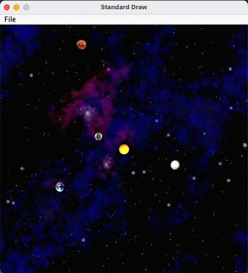

<h2 align="center">ArrayDeque</h2>

    

    <a href="https://cs61bl.org/su20/projects/deques/">Spec</a>

Made an array deque data structure from scratch in Java. Also implemented unit tests with junit5. It was the first time using a testing framework and an introduction to TDD (Test Drive Development). I had to heavily rely on writing my own tests since the autograder had hidden tests. From here on, I realized the importance of unit tests and still use it heavily on all of my projects whenever possible.

    

<h2 align="center">Gitlet</h2>

    

    <a href="https://cs61bl.org/su20/projects/gitlet/">Spec</a>

A Git clone made in Java using SHA-1 serialization and basic data structures (not to be confused with `git clone`). Can do basic version control system through the command line such as init, add, commit, log, find, status, branch, checkout, merge, rebase, push, pull, etc. Made unittests with junit5, as well as integration tests with Python automating shell scripts/Gitlet commands. It was a great project to understand how Git works. This by far, was the most intense software engineering project I've ever done at that point. I learned about version control, data structures, and software engineering in general. Of course, there are even more hardcore and intense projects after this, but this was the first one that really made me think about how to design a software system. It was also the first one where I made a design document to plan out the system design.

    

<h2 align="center">BearMaps</h2>

    

    <a href="https://cs61bl.org/su20/projects/bearmaps/">Spec</a>

Created a mini web map application deployed on Heroku using OpenStreetMap of Berkeley. Application uses data structures and algorithms such as tries, hashing, A* shortest path, rasterizing, and KD-trees. Integrated unittests with junit5. Cool little website where we use a little bit of AI to do the route finding. Website is availiable to view by clicking on the image below (It's very slow to load since it's on Heroku Free Tier)!

    <a href="http://bearmaps-briancpark.herokuapp.com/map.html">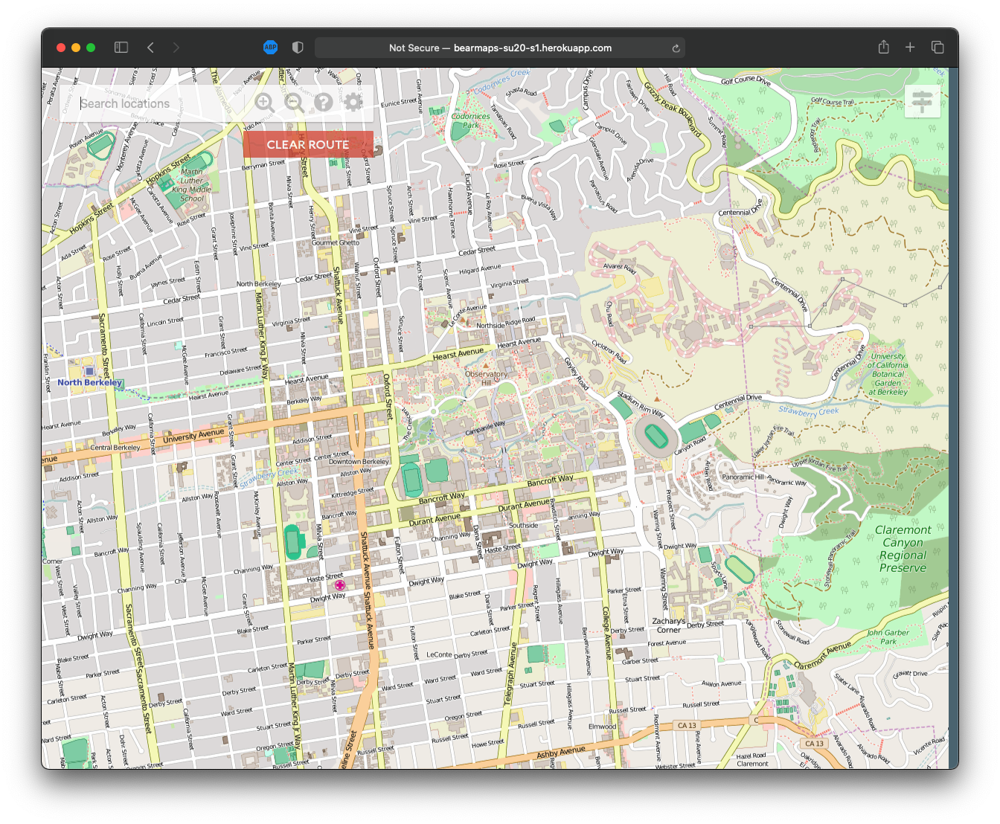</a>

<h2 align="center">Game of Life</h2>

    

    <a href="https://cs61c.org/fa20/projects/proj1/">Spec</a>

Implemented John Conway's Game of Life in C through bit manipulations to produce bitmap images and movies. Uses shell scripts to make movies out of image frames, as well as testing. It was also my first project in C, so I learned how to meticulously debug with `gdb` and check for memory leaks with Valgrind. Made some pretty cool movies with this project! This was a single threaded implementation, but later on I learned how to accelerate this with SIMD and MIMD!

    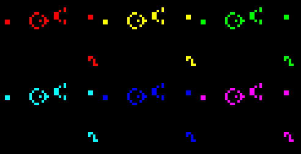

<h2 align="center">RISC-V Classify</h2>

    

    <a href="https://cs61c.org/fa20/projects/proj2/">Spec</a>

Made an artificial neural network in RISC-V assembly. Uses Venus, a Java backend RISC-V simulator to run assembly code. Matrix and vector operations were implemented such as ReLU, argmax, and matrix multiply. Can train and classify MNIST digit dataset with greyscale images mapped with values from 0 to 255 of size 28x28 (was restricted to the integer instruction set). Uses Python unittest library to run unit and integration tests in conjucttion with the Venus simulator. Also uses bash scripts to automate development/testing workflow. It was my first project in assembly, so it was cool to see how to convert such a high level mathematical algorithm down to an option of 47 instructions that a CPU understands!

In an advanced computer architecture class, I further learned how to accelerate matrix multiplication in assembly using the RISC-V vector extension (RVV) instrinsics!

    

<h2 align="center">RISC-V CPU</h2>

    

    <a href="https://cs61c.org/fa20/projects/proj3/">Spec</a>

Designed a CPU with datapath, control logic, and memory fully implemented in Logisim following the RISC-V 32-bit ISA. Design scored top 100 out of 1200+ students based on how many logic gates were efficiently used. Uses Venus, a Java backend RISC-V simulator to convert assembly code to machine code and input it into Logisim. Uses Python and bash scripts to automate assembling, execution, integration tests, and development workflow. Overall, was really cool to design an actual working (virtualized) CPU and also see it run previous projects/code in RISC-V assembly. Now I can code or compile any program that will run on my CPU! And it's really amazing to understand how our own CPUs work at a low level!

    

<h2 align="center">Numc</h2>

    

    <a href="https://cs61c.org/fa20/projects/proj4/">Spec</a>

Made a NumPy library clone in C. Used SIMD and MIMD to accelerate matrix operations, with frameworks such as Intel AVX Intrinsics and OpenMP, as well as optimizations with caches and virtual memory. Benchmarked 110X speed up in DGEMM and 2200X in matrix exponentiation on an Intel i7-4770 processor. Scored on average top 100 out of 1200+ students out of multiple categories, scored top 10 in matrix unary/binary operations category. Uses Python C interface/API to connect C code to Python, as well as using Python unittests and CUnit testing framework to do unit and integration tests. Uses bash script to automate compilation, testing, and development workflow.

This was one of the most rewarding projects, as I had to understand how the compiler works down to instuction level and got to see code drastically run faster! I was addicted to this iterative process of optimizing code, benchmarking, and seeing the speedups. This project sparked my interest in high performance computing and it's what shaped my career and research path.

Our code was evaluated on shared servers, so I had to stay up late night when no other users were on the server. These were pretty old machines with 32GB of RAM. There were 20 machines shared amonst 1200+ students. That's over 60 students per machines! I had to stay up pretty late to get the best environment for evaluation. Looking back, I wish there was a Slurm scheduler to manage the resources. A funny story is I remember crashing the server once when I was running a benchmarking script. I had a crucial memory leak that just accumulated after every run. And with some other users on the same server running the same project, it was enough to hit OOM and fully crash the server. I was so embarrassed, but also so sleepy that I called it a day. Luckily, I don't think anyone noticed and the server was back up the next day. It's funny to look back again, because once in person sessions started after COVID-19, I wondered where these servers were located. Turns out they are just lab computers located on the third floor of Soda Hall, publicly accessible to anyone. These computers were not even locked up in a proper server room and were just tiny desktop boxes.

    

<h2 align="center">Pacman AI</h2>

    

    <a href="https://inst.eecs.berkeley.edu/~cs188/fa20/projects/">Spec</a>

Encoded a series of AI functionality to the game of Pacman in Python, such as searching algorithms, gametrees, MDPs, reinforcement learning, and Bayesian networks. Scored 5th for best AI agent out of 600+ students. Overall, very fun projects, and maybe even philosophical. It was interesting to see simple algorithms map to simulating intelligence. I remember after finishing a project, I would "test" its intelligence by trying to beat it myself. Of course, the bot always won, but then again, did ***I*** win because I programmed the AI?

    

<h2 align="center">Neural Networks</h2>

    

    <a href="https://inst.eecs.berkeley.edu/~cs188/fa20/project5/">Spec</a>

Created neural networks from scratch to estimate sine wave, classify digits, and classify different languages. It was my first dive into implementing neural networks, and the reward of achieving high accuracy peaked my interesting in machine learning!

    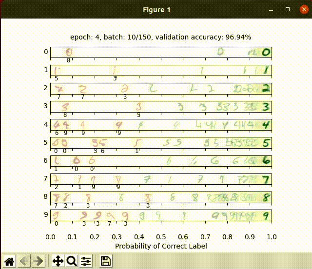

<h2 align="center">Algorithms Homework</h2>

    

Programmed algorithms in Python and wrote homework solutions in LaTeX. Went over divide and conquer, greedy algorithms, dynamic programming, linear programming, P vs. NP, and many more. This was the most theory thrown at me. I liked coding, so in order to confirm my theory was right, I confirmed solutions by writing them in Python as well as solving any additional LeetCode problems related to the topic.

<h2 align="center">Zoom Rooms</h2>

    

    <a href="https://github.com/Berkeley-CS170/project-fa20-skeleton">Spec</a> 
    <a href="https://berkeley-cs170.github.io/project-leaderboard-fa20/">Public Leaderboard</a>

Devised algorithms to solve a NP-Hard of graph parititioning problem. Uses NetworkX to generate and compute graphs. It was hard to try to generalize, but found a way to brute force small graphs to achieve first place on the leaderboard, and then devise a greedy algorithm to score on average top 50% of the leaderboard for medium and large graphs! It was a fun project to convert theory into practice. I remember running these algorithms on my octacore Intel i9 processor with 32GB of RAM. But that really meant nothing because the code wasn't parallelized. It took 10+ hours to get results. I remember thinking afterwards, "I wish I knew how to parallelize code!". It was only until after the project, I learned about parallelism from my computer architecture course and that there's a way to utilize it. Since it was in Python, I could've utilized `multiprocessing` or parallel programming frameworks like Ray, Spark, or Dask. Welp, now I know!

This was a lucky opppurtunity to take a class with Professor [Umesh Vazirani](https://people.eecs.berkeley.edu/~vazirani/), a pioneer in quantum computing and the author of the textbook we used.

    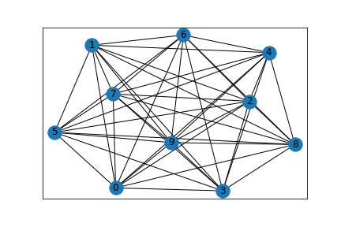

<h2 align="center">16A Touch Screen</h2>

    

    <a href="https://inst.eecs.berkeley.edu/~ee16a/fa20/">Course Website with Spec</a> 

Built a 2D resistive touchscreen and capacitive touchscreen with breadboard components and TI MSP-EXP430F5529LP microcontroller. This was for an introdcutory class to circuits and linear algebra. This project usually teaches you how to solder. Since this was taken during the pandemic, we were limited to only connecting circuits via breadboarding.

<h2 align="center">SIXT33N Voice Activated Self-Driving Car</h2>

    

    <a href="https://inst.eecs.berkeley.edu/~ee16b/sp21/">Course Website with Spec</a> 

Made a self-driving car with circuits, op-amps, filters, and sensors with a TI MSP-EXP430F5529LP microcontroller. Software is written in C++ and can recognize four voice commands corresponding to four actions. Commands are classified with unsupervised learning technique using principal components analysis. I'm not an hardcore enjoyer of circuits, but it was so exciting to see a car run with my own voice commands and circuits I connected!

I remember frying 3 of my microcontrollers. During the final presentation, I had to really be careful not to short my last one! We were in a silicon shortage, and I remember Raspberry Pis being very difficult to find at the time. Even the TI MSP-EXP430F5529LP microcontrollers were very hard to find in stock, so I bought 3 additional microcontrollers in in bulk. I was so scared that I would short my very last one, but fortunately, I was able to present a working car and pass.

    

<h2 align="center">Kaggle InClass Prediction Competition</h2>

    

    <a href="https://people.eecs.berkeley.edu/~jrs/189/">Course Website with Spec</a> 
    <a href="https://www.kaggle.com/briancpark/competitions?tab=completed">Public Leaderboard</a>

Scored on average top 5% of the class in Kaggle InClass Prediction Competitions for a machine learning course consisting of 600+ graduate and undergraduate students. Competed for the best classifiers such as SVMs, GDA, Logistic Regression, Decision Trees/Random Forests, Neural Networks, Latent Discriminatnt Analysis developed from scratch in Python. Trained and classified datasets like MNIST Digits, MNIST Fashion, Spam/Ham, CIFAR-10, wine, Titanic, movie datasets. Uses libraries such as NumPy, Pandas, SciPy, Matplotlib, and sklearn to help with data preprocessing and numerical computations. Wrote homework solutions in LaTeX as well as coding in Jupyter notebook environment. Overall, had fun with deriving math problems/algorithms and implementing them in code to be rewarded with high classification accuracy!

Training models took horrendously long. None of these were accelerated on the GPU, except for the neural networks project. I remember staying up late at night to ensure my model was functioning correctly and my laptop suffering with fans at full blast overnight. All my cores were blasted at 100% utilization with very high memory usage on my octacore Intel i9 MacBook Pro 32GB. These models were so power hungry that my laptop started discharging battery, even if it was plugged in (100W). I remember waking up to my laptop in the morning with battery nearly about to die. Then I had to quit and checkpoint my model to let my battery and laptop recover in order to attend Zoom online classes. I couldn't continue training during the day becuase then either my laptop would die or my Zoom class would be really laggy.

For the neural network homework, I remember being frustrated as I wanted to train a large model to get high accuracy on the Kaggle leaderboard. I didn't have a NVIDIA GPU at hand, so I tried to use Google Colab. Google Colab (free tier) has this feature where it shuts off your instance after 12 hours. I lost all my progress as I didn't checkpoint my model after a training session, wasting 12 hours. I later used Kaggle Notebook, where they give you 38 hours of uninterrupted GPU usage. This is where I really wished I had a RTX 3090Ti or really any NVIDIA GPU at the time, but we were going through a GPU/silicon shortage. These frustrations with performance and hardware limitations motivated my interest in high peroformance computing and code optimization for ML.

    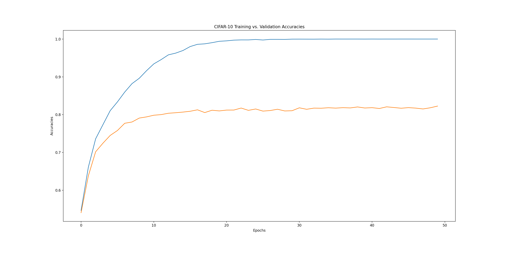

<h2 align="center">Data Science Homework</h2>

    <a href="https://ds100.org/sp21/">Course Website with Spec</a> 

Completed a series of homework related to data science. Involved the full data science lifecycle, from data cleaning, making visualizations, evaluating models, and reasoning the data. Got hands dirty with a variety of machine learning/data science packages such as Pandas, Numpy, Matplotlib, scikit-learn, Seaborn, SciPy, and Plotly.

##
<h2 align="center">Pintos</h2>

    

    <a href="https://inst.eecs.berkeley.edu/~cs162/fa21/static/proj/proj1-userprog.pdf">Spec (User Programs)</a>-<a href="https://inst.eecs.berkeley.edu/~cs162/fa21/static/proj/proj2-threads.pdf">Spec (Threads)</a>-
    <a href="https://inst.eecs.berkeley.edu/~cs162/fa21/static/proj/proj3-filesys.pdf">Spec (File System)</a>

Improved upon the Pintos operating system written in C by implementing support for system calls, FPU, timers, schedulers, user threads, buffer cache, filesystem, and subdirectories. This was by far one of the most challenging projects I have ever worked on. To write such low level kernel code in C, I had to learn a lot of new concepts and techniques. It was also not as easy to debug, especially with working with concurrent threads under a threading impelmentation that I had to create myself. I've not only sharpened my skills as a C developer and skills in `gdb`, but also sharpened my design process, teamworking, and leadership skills. I don't think I would've landed my first internship without the help, knowledge, and skills gained from this course and project.

In the end, we're able to fully compile the kernel and execute it on a virtual machine! I could've also ran it on a real machine (x86), but I didn't have a spare laptop to try this on bare metal.

The projects has grounded my foundation of operating systems, systems programming, and C programming. I remember the nights where I'd be frustrated at the autograder and being stuck at debugging through kernel code through layers of C via `gdb`. Some nights I cried, other nights I laughed at the absurdity of my own code. But in the end, I pushed through with a lot of patience and perseverance. Surprisingly, I made the most amount of friends from this class through office hours. For some reason, suffering together created stronger bonds with fellow students, who were not even in my project group. Since we couldn't look at each others code as we were in different groups, we discussed high level implementations and then tried to reason through our own implementations of code. Maybe it was due to the semester being the first in person semester after COVID-19, or because I pushed through a class that was notoriously difficult, but this is one of the first times I felt accomplished.

The course was shortly staffed, but they were extremely helpful, including the smartest undergraduates I knew as well as one of the most top tier PhD students I've seen. This was also a very lucky oppurtunity to take a class under professor [Ion Stoica](http://people.eecs.berkeley.edu/~istoica/), a legend in the field of distributed systems (industrial and research)! I've learned a lot from him and the startups he founded, [Ray](https://www.ray.io) and [Apache Spark](https://spark.apache.org) being tools that I still use to this day.

    

##
<h2 align="center">Operating Systems Homework</h2>

    

    <a href="https://inst.eecs.berkeley.edu/~cs162/fa21/static/hw/hw1-list.pdf">Spec (List)</a>-<a href="https://inst.eecs.berkeley.edu/~cs162/fa21/static/hw/hw2-shell.pdf">Spec (Shell)</a>-<a href="https://inst.eecs.berkeley.edu/~cs162/fa21/static/hw/hw3-scheduling.pdf">Spec (Scheduling)</a>-<a href="https://inst.eecs.berkeley.edu/~cs162/fa21/static/hw/hw4-httpserver.pdf">Spec (HTTP Server)</a>-<a href="https://inst.eecs.berkeley.edu/~cs162/fa21/static/hw/hw5-memory.pdf">Spec (Memory)</a>-<a href="https://inst.eecs.berkeley.edu/~cs162/fa21/static/hw/hw6-malloc.pdf">Spec (Malloc)</a>

Did a series of programming assignments for an operating systems course. Some of these assignments were pretty difficult and are worth to be regarded as mini-projects. These were done on the side of the Pintos project. Some of the assignments were eventually integrated to the full implmentation of Pintos after the course ended.

* List: Used linked lists to count up words in a file. Then used threading to count up words for multiple files per threads using the pthread library. This was a warmup assignment to get used to the development environment and data structures to be used for our course project.
* Shell: Built a sinple shell. Added support for `pwd`, `cd`, program execution, path resolution, input/output redirection, piping, signal handling, and terminal control.
* Scheduling: Implemented Shortest Remaining Time First (SRTF) and Multilevel Feedback Queue (MLFQ) schedulers. Then evaluated the utilization and fairness of the schedulers. These schedulers and experiements were emulated using Python. No C programming here. It was just a lot of simulation, theory, and math.
* HTTP Server: Built an HTTP server that handles HTTP GET requests. Added functionailty for HTTP response headers, HTTP error codes, HTML directory listings, and HTTP proxy.
* Memory: Improved upon the Pintos operating system to allow for dynamic memory allocation and stack growth. We had to do this using the `sbrk` syscall.
* Malloc: Implemented `malloc`. Compared to the Memory homework, now we had to dynamically allocate the heap and manage the heap ourselves. This was a lot more difficult than the Memory homework. We also used `sbrk` syscall to allocate memory. We had to not only implement the allocation algorithm, but also deallocation and reallocation. Also considering fragmentation, we had to properly coalesce free blocks.

Yeah, you're right, it's not as easy as it sounds. Some assignments were really frustrating like the `malloc` assignment. I would be so deep into the coding process that I burn out, sleep, then dream about debugging sessions through `gdb`, only then to wake up with a clear solution in mind. I remember my friends and I pinging each other for any tips on how to approach or debug towards a solution. The assignments were done indiviually, but we were encouraged to discuss with each other. These late night conversations with friends grew my ability share and convey technical ideas clearly via words or a whiteboard, which I felt like COVID-19 prevented this opportunity.

    

##
<h2 align="center">Capture the Flag - Exploiting Memory Vulnerabilities</h2>

    

    <a href="https://fa21.cs161.org/proj2/">Spec</a>

Exploited memory vulnerabilities in C via buffer overflow. The project was setup like a CTF competition where we had to find the exploit in order to proceed to the next section. We had to use `gdb` to find the memory exploit and get the flag to proceed on to the next task. We used Python to execute our memory exploits. We had to do things, like exploit stack canaries, TOCTOU, ret2esp.

    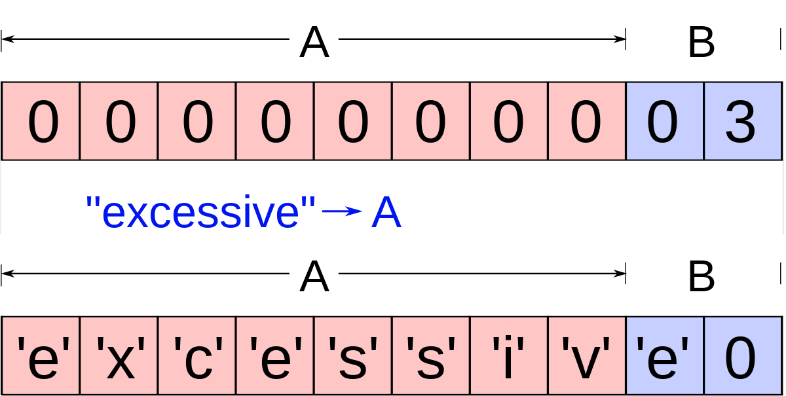

##
<h2 align="center">Secure Filesystem</h2>

    

    <a href="https://fa21.cs161.org/proj2/">Spec</a>

Implemented a filesystem in Go with secure cryptographic encryption schemes that ensure confidentiality, authenticity, and integrity of data. Wrote security attacks and tests with Ginkgo and Gomega testing frameworks. Used cryptographic functions such as public key encryption, digital signatures, hash-based message authentication code (HMAC), hash-based key derivation function (HashKDF), password-based key derivation function (PBKDF), and symmetric encryption. This project exercised my design process to a much more theoretical level. It's not as easy to design code that's also cryptographically secure.

The project also had a hidden autograder, so no one in the class knew if their code was secure or not until the end of the project. In the reality, you won't know what the security vulnerabilities actually are, so having the hidden autograder setup a real world scenario. It was basically a code exam. I had to aggressively unittest my code to ensure that it was secure.

I was so burnt out from the Pintos project, which was concurrently done with this one. So to make it fun and motivated, I made my unittests Mr. Robot themed. Even though I started early, I began to realize how weak my implementation was at the start until I attended some office hours. I spent hours discussing with other students at a high level how to develop cryptographic encryption schemes, and we counter argued and critiqued each others' design.

After this realization of a flaw in my design, I spent the beginning of Thanksgiving break working on this project. Luckily, I finished on Thanksgiving day and celebrated by exploring around Oakland as well as FaceTiming my family during dinner. Overall, this project was a great introduction to cryptography and security, as well as an oppurtunity to learn Golang. The picture below is a cute picture I found of the Go gopher mascot being a security guard. This imaginary gopher guard helped me implement a secure filesystem!

    

##
<h2 align="center">Capture the Flag - Website Exploitation</h2>

    

    <a href="https://fa21.cs161.org/proj2/">Spec</a>

Exploited a website using SQL injection, cross-site scripting, and cross-site request forgery. The project was setup like a CTF competition. This project wasn't difficult, but it exercised my problem solving skills. It felt like solving a puzzle.

    

##
<h2 align="center">Parallel Computing Homework</h2>

    

    <a href="https://sites.google.com/lbl.gov/cs267-spr2022/hw-1">Spec (Optimizing DGEMM with Intel Intrinsics)</a>-<a href="https://sites.google.com/lbl.gov/cs267-spr2022/hw-2-1">Spec (Particle Simulation with OpenMP)</a>-<a href="https://sites.google.com/lbl.gov/cs267-spr2022/hw-2-2">Spec (Particle Simulation with MPI)</a>-<a href="https://sites.google.com/lbl.gov/cs267-spr2022/hw2-3">Spec (Particle Simulation with CUDA)</a>-<a href="https://sites.google.com/lbl.gov/cs267-spr2022/hw-3">Spec (Genomics Simulation with UPC++)</a>

I did a series of programming assignments in parallel computing, utilizing some of the most popular parallel computing systems used today. These assignments were large enough to be called mini-projects.

* Single Core DGEMM: Used SIMD instructions to achieve near theoretical peak performance of DGEMM on a single core Intel KNL processors. We didn't apply TLP (thread level parallelism) for this project (It probably would've been difficult trying manage cache coherency across 68 cores/272 threads). There was so many bizarre archtitectural features to take advantage of in this project. There's 3D stacked memory, as well as AVX512 instructions. We were able to use a research paper that directly tackled this problem [An implementation of matrix-matrix multiplication on the Intel KNL processor with AVX-512](https://dl.acm.org/doi/abs/10.1007/s10586-018-2810-y). Unfortunately, the paper did not link to any code artifacts, so we had to reverse engineer the paper to apply their theory presented in their paper into practice. Afterwards, I realized that one of the coauthors was a math PhD student at Berkeley! So I was able to contact him for the source code. We weren't close at all in terms of performance, and that was mainly due to other optimizations such as using Intel's `icc` compiler (we were limited to using `gcc`) and taking advantage of the 3D stacked memory and the 4 hyperthreads per core. But we did get good performance relative to the class's implementations, so I'll take that as a win!
* Particle Simulation: Implemented a $n$-body particle simulation on mutliple programming systems.
  * Serial: We first applied algorithmic optimizations to speed up the code. We were able to cut down the $n$-body particle simulation from $O(n^2)$ to $O(n)$ runtime. We achieved this by particle binning, where we bin particles into a grid, and then only compute the forces between particles in the same or neighboring bins.
  * OpenMP: The next optimizations after achieving speedups serially was to achieve speedups with TLP. We used OpenMP to parallelize the code, utilizing all 272 threads on a KNL processor! That's a lot of threads!!! We had to apply lots of synchronization though, to ensure correctness as well as cache coherency. What's weird is that even with 272 threads, I did not observe substantial speedups beyond 68 threads. The KNL processor had 68 cores, but had 4 hyperthreads per core. In my experience, SMT (Simultaneous Multi Threading) usually benefits concurrency, and not parallelism, since each hyperthread usually shares the same resources or ALU in our case. Since we were parallelizing simulations that were arithmetically intensive, I thought maybe that was why there was not much of a speedup.
  * MPI: How can we scale beyond the 272 threads we were limited to on a single node? The answer is distributed computing, and we used MPI to achieve this scalability and speedup. By far, this was the most difficult assignment yet, as it was extrememly DIFFICULT to debug MPI programs. I hope there is ongoing research and industrial effort to make this easier in the future, as it was a really steep learning curve to try to learn how to debug MPMD programs properly and efficiently.
  * CUDA: This was the most fun assignment yet, by far. I've always wanted to code on a GPU, and this was my moment. I imagined coding would be done on a GPU such as RTX 3080 or RTX 2080, but no. There were even more powerful GPUs than that targeted to HPC programmers, the NVIDIA V100. And I had the fortunate oppurtunity to code on a DGX-1 system, which is estimated to be around a whopping $150K! The next extension after this is to use distributed systems using NCCL, which I got a taste of in my final project. But for particle simulation, I was able to get the fastest speedup compared to the other programming systems. I guess that proves that point that GPUs are awesome!
* Genome Assembly: Implmented a distributed hash table using UPC++, a PGAS (Partitioned Global Address Space) extension for C++, to do genome assembly. We had to use UPC++ directves to parallelize our code across cores and nodes. Fortunately, compared to MPI, the communication is abstracted since there's no explicit communication primitives required. So it was relativelty simple to implement once the algorithm to parallelize is understood.

The CPU simulations and benchmarks were done on Cori KNL nodes (Intel Xeon Phi 7250) on the NERSC supercomputer (<a href="https://www.top500.org/lists/top500/">Top 500</a>) and the GPU simulations were done on Bridges-2 supercomputer in PSC (8 NVIDIA Tesla V100 32GB per node). I had such a blast writing and running code on such expensive and powerful hardware. It's an absolute pleasure to write such perfomant code and see it outperforming any other code I have written before! Programming on these machines were a dream come true! I've also become a Slurm guru after constantly using and debugging the supercomputers.

This class was a lucky oppurtunity to take a course taught by legendary HPC professors [Aydın Buluç](http://people.eecs.berkeley.edu/~aydin/) and [James Demmel](http://people.eecs.berkeley.edu/~demmel/). This class was also taught by some top tier PhD students, some of who were previously my TAs from my operating system course. As it was my last semester at UC Berkeley, I couldn't be more satisfied with the way the course was taught, my succeess in it, and what I learned from it.

    

##
<h2 align="center">Computer Architecture Labs</h2>

    

     <a href="https://inst.eecs.berkeley.edu/~cs152/sp22/assignments/sp22/lab1.pdf">Spec (Lab 1)</a>-<a href="https://inst.eecs.berkeley.edu/~cs152/sp22/assignments/sp22/lab2.pdf">Spec (Lab 2)</a>-<a href="https://inst.eecs.berkeley.edu/~cs152/sp22/assignments/sp22/lab3.pdf">Spec (Lab 3)</a>-<a href="https://inst.eecs.berkeley.edu/~cs152/sp22/assignments/sp22/lab4.pdf">Spec (Lab 4)</a>-<a href="https://inst.eecs.berkeley.edu/~cs152/sp22/assignments/sp22/lab5.pdf">Spec (Lab 5)</a>

Series of computer achitecture labs written in C/C++/RISC-V assembly. Used Chisel to write hardware descriptive code and Chipyard framework to run variety of RISC-V simulators. These projects were fun, as they had open ended sections where we were free to explore topics.

* Lab 1: We did case studies on a RISC-V simulators (Chipyard) on a 1-stage and 5-stage pipelined processors, analyzing the instruction mixes and CPI. We then wrote C code to compile to RISC-V assembly that reaches the maximum number of branch instructions. We were only limited to 15 lines of C code, and that was not simple to do. I had to think creatively on how to work against the compiler, because the compiler can do a lot of optimizations that try to reduce the number of branch instructions.
* Lab 2: Did case studies on matrix tranposition to study the effects on cache. Then we were given an mystery simulator configuration, and were tasked to figure out what the memory and cache configurations were by running experiments.
* Lab 3: Used BOOM (Berkeley Out-of-Order Machine) to do case studies on different kinds of branch predictors. Then designed and wrote my own branch predictor.
* Lab 4: We used the RVV. This was a new programming model, as RISC-V vector extension doens't use a packed SIMD model. that removes the issue of encoding the length of a vector from the ISA. We had to write vector assembly routines for `cxaxpy`, `cmplxmult`, `dgemv`, `dgemm`, `imax`.
* Lab 5: This lab focused on the study of different cache coherence protocols and shared memory. We used a dual-core Rocket processor supporting the RV64GC ISA as a simulator target. We optimized and studied the effects of data level parallelism and thread level parallelism of `vvadd` and `matmul`. Since we had a simulator, we can exactly count the number of cycles, CPI/IPC, and cache misses.

    

##
<h2 align="center">Efficient Video Super Resolution for Mobile Device</h2>

    

This project tasked me to tackle real world problems we see today. Used state of the art (SOTA) Super Resolution DNNs and accelerated them to be deployable on mobile devices. We were tasked to do this in *real-time*. I had to use my knowledge of high performance computing and apply it to mobile devices and machine learning. That's a surprisingly difficult task, especially with today's advancements in AI/ML for mobile devices and the slowing down of Moore's Law. We are constrained by the compute power, energy, memory, and storage of a mobile device. You cannot necessarily solve that issue with more powerful hardware since we're limited by physics. Though the rise of accelerators on mobile devices, such as ARM's SME and Apple's Neural Engine, has made it possible to run deep learning models on mobile devices efficiently, latency and energy wise.

I used [CoCoPIE XGen: A Full-Stack AI-Oriented Optimizing Framework](https://arxiv.org/abs/2206.10620), to accelerate the Super Resolution model for mobile device. [CoCoPIE](https://www.cocopie.ai) is a startup founded by my professor [Xipeng Shen](https://people.engr.ncsu.edu/xshen5/). Their software, [XGen](https://xgen.cocopie.ai/), was released before the semesester started, so I was able to report a few issues and bugs related to my use case in SOTA Super Resolution models. We ran into many issues, but I don't blame the XGen team at all. They were still at an early stage of development and they were prompt in responding to issues and trying to fix them. Doing this project challenged me to tackle real life problems in engineering and industry, where I have to find unique solutions to work around problems blocking me. XGen was not the only tool I had issues with, as I had many issues with using TVM, TensorRT, and NNI. I learned how to use TVM, TensorRT, ONNX, ONNX Runtime, and CoreML and used that to compare the perfomance of state of the art frameworks today. 

The repo has been available to view [here](https://github.com/briancpark/video-super-resolution).

##
<h2 align="center">High Performance Machine Learning Projects</h2>

    

Applied state of the art techniques to accelerate DNNs in PyTorch. Used NNI to do pruning, quantization, hyperparameter tuning, and knowledge distillation. Used TVM to apply compiler optimizations to DNN models for efficient inference runtime. This was another chance for me to use Bridges-2 supercomputer. These were warmup projects that eventually were applied to the final project of Efficient Video Super Resolution for Mobile Device.

The repo has been available to view [here](https://github.com/briancpark/csc791-025).

<h2 align="center">Compiler Theory Projects</h2>

    

Detected integer overflow and analyzed instructions using [DrCCTProf](https://github.com/xuhpclab/drcctprof), which is built on top of [DynamoRIO](https://github.com/DynamoRIO/dynamorio). These were just toy projects to use a profiler to analyze simple C code and understand compiler theory.

    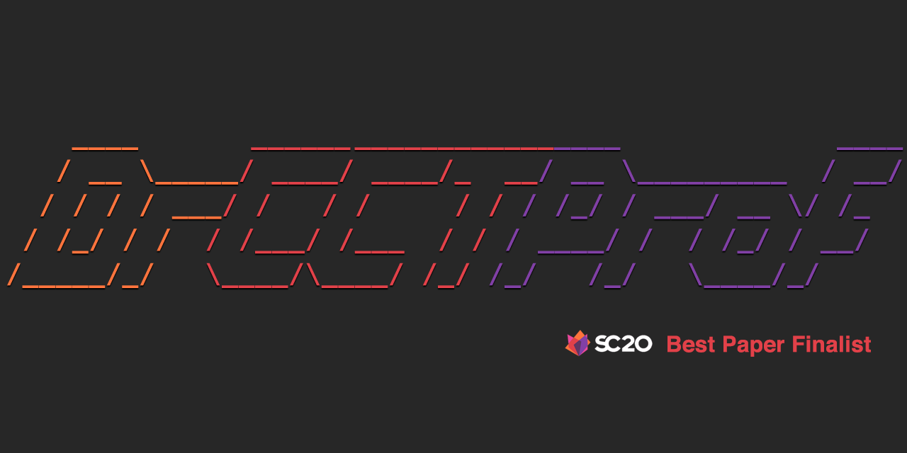

##
<h2 align="center">Conclusion</h2>
Every semester awaits an interesting project or assignment applying the knowledge learned in class. I make it a mission to pour 100% of my effort into every project I work on, whether it's on the job, for school, or for a personal side project. Computer Science is a very broad topic, so it's not easy to keep track of every project and what I learned from each one of them. Hell, I've went from basic Python programming, building web apps, designing a CPU, writing matrix multiplication in Assembly and accelerating it with SIMD and MIMD, writing kernel code for a toy OS, accelerating particle simulation by 1000X+ on today's top supercomputer, to accelerating state of the art deep learning models. It's a crazy ride of topics and domains to go through. Although most of these are toy projects and aren't applicable or deployable into the real world, they are still fun problems to tackle and understand fundamentals from. Having a bachelors and masters degree does not mean the learning ends there though, and I wish to continue to self learn and build personal projects on the side!